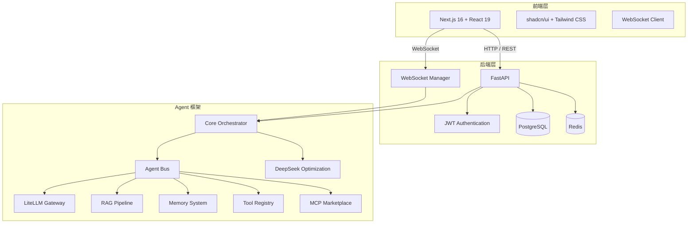

# AloneChat Workspace

[](https://www.python.org/)
[](https://nodejs.org/)
[](https://fastapi.tiangolo.com/)
[](https://nextjs.org/)
[](LICENSE)

> 生产级 AI Agent 协作平台 —— 实时聊天与智能 Agent 的深度融合

**AloneChat Workspace** 是一个集成了实时聊天应用与生产级 AI Agent 框架的全栈协作平台。它提供即时通讯的实时性，同时通过大型语言模型（LLM）驱动的智能 Agent 系统，实现自动化任务执行、RAG 知识检索、多 Agent 编排和工具调用能力。

---

## 核心特性

- **实时聊天应用** —— 基于 WebSocket 的即时通讯，支持私聊、群组、文件共享
- **AI Agent 框架** —— 生产级 Agent 网关，支持 ReAct、Multi-Agent 等多种模式
- **RAG 知识检索** —— 基于 ChromaDB 的向量检索与文档问答
- **MCP 市场** —— 支持 Model Context Protocol 服务器的注册、管理和工具调用
- **DeepSeek 优化** —— 上下文压缩、语义缓存、消息排序等百万级上下文优化
- **沙箱安全执行** —— 子进程隔离的代码执行环境
- **可观测性** —— 完整的日志、指标和链路追踪

---

## 项目结构

```
AloneChat-workspace/
├── chat-app/                 # 实时聊天应用
│   ├── backend/              # FastAPI 后端服务
│   │   ├── main.py           # 应用入口
│   │   ├── auth.py           # JWT 认证
│   │   ├── models.py         # SQLAlchemy 数据模型
│   │   ├── websocket_manager.py  # WebSocket 连接管理
│   │   ├── routers/          # API 路由
│   │   ├── services/         # 业务服务
│   │   └── tests/            # 后端测试
│   └── frontend/             # Next.js 前端应用
│       ├── src/app/          # 页面路由
│       ├── src/components/   # React 组件
│       └── public/           # 静态资源
├── agent-framework/          # AI Agent 框架
│   ├── agent_framework/      # 框架核心包
│   │   ├── core/             # 核心抽象（AgentBus、Orchestrator）
│   │   ├── agent/            # Agent 实现（ReAct、Multi-Agent）
│   │   ├── gateway/          # Agent 网关服务
│   │   ├── llm/              # LLM 提供商（LiteLLM）
│   │   ├── memory/           # 记忆系统（对话、向量）
│   │   ├── rag/              # RAG 流水线
│   │   ├── tools/            # 工具注册与内置工具
│   │   ├── deepseek_optimization/  # DeepSeek 专项优化
│   │   │   ├── cache/        # 多级缓存系统
│   │   │   ├── context/      # 上下文压缩与管理
│   │   │   ├── llm/          # DeepSeek 提供商
│   │   │   ├── mcp_marketplace/  # MCP 市场
│   │   │   ├── security/     # 安全与审计
│   │   │   └── swe/          # 软件工程 Agent
│   │   ├── observability/    # 可观测性
│   │   └── security/         # 限流与安全
│   ├── examples/             # 使用示例
│   └── tests/                # 框架测试
├── docs/                     # 架构文档与设计文档
├── bugs/                     # Bug 追踪与安全审计
└── Makefile                  # 统一构建入口
```

---

## 技术栈

### 后端
| 技术 | 用途 |
|------|------|
| [FastAPI](https://fastapi.tiangolo.com/) | 高性能异步 Web 框架 |
| [SQLAlchemy 2.0](https://www.sqlalchemy.org/) | ORM 与数据库交互 |
| [Alembic](https://alembic.sqlalchemy.org/) | 数据库迁移管理 |
| [PostgreSQL](https://www.postgresql.org/) | 关系型数据库 |
| [Redis](https://redis.io/) | 缓存与消息队列 |
| [WebSockets](https://developer.mozilla.org/en-US/docs/Web/API/WebSockets_API) | 实时双向通讯 |
| [JWT](https://jwt.io/) | 身份认证与授权 |

### 前端
| 技术 | 用途 |
|------|------|
| [Next.js 16](https://nextjs.org/) | React 全栈框架 |
| [React 19](https://react.dev/) | UI 库 |
| [Tailwind CSS 4](https://tailwindcss.com/) | 原子化 CSS |
| [shadcn/ui](https://ui.shadcn.com/) | 组件库 |
| [Radix UI](https://www.radix-ui.com/) | 无头组件基座 |
| [Tiptap](https://tiptap.dev/) | 富文本编辑器 |

### Agent 框架
| 技术 | 用途 |
|------|------|
| [LiteLLM](https://www.litellm.ai/) | 多模型 LLM 统一网关 |
| [ChromaDB](https://www.trychroma.com/) | 向量数据库 |
| [NetworkX](https://networkx.org/) | DAG 工作流编排 |
| [Tenacity](https://github.com/jd/tenacity) | 重试与容错 |

---

## 环境要求

- **Python**: 3.11+
- **Node.js**: 18+
- **PostgreSQL**: 16+
- **Redis**: 7+

---

## 快速开始

### 1. 克隆仓库

```bash
git clone https://github.com/xiaodu-duhongrui/AloneChat-workspace.git
cd AloneChat-workspace
```

### 2. 创建 Python 虚拟环境

```bash
# 后端虚拟环境
cd chat-app/backend
python -m venv venv
# Linux/macOS
source venv/bin/activate
# Windows
. venv\Scripts\activate

# Agent 框架虚拟环境
cd ../../agent-framework
python -m venv .venv
# Linux/macOS
source .venv/bin/activate
# Windows
. .venv\Scripts\activate
```

### 3. 安装依赖

```bash
# 在项目根目录执行
cd ../..
make install
```

### 4. 配置环境变量

```bash
# 复制后端环境变量模板
cp chat-app/backend/.env.example chat-app/backend/.env

# 编辑 .env 文件，配置数据库连接、Redis、JWT 密钥等
```

### 5. 初始化数据库

```bash
make db-init
```

### 6. 启动开发服务器

```bash
# 同时启动后端和前端
make dev

# 或分别启动
make dev-backend   # FastAPI 服务 (http://localhost:8000)
make dev-frontend  # Next.js 服务 (http://localhost:3000)
```

---

## Makefile 命令速查

| 命令 | 说明 |
|------|------|
| `make install` | 安装所有依赖（pip + npm） |
| `make dev` | 同时启动后端 + 前端 |
| `make dev-backend` | 仅启动后端开发服务器 |
| `make dev-frontend` | 仅启动前端开发服务器 |
| `make test` | 运行全部测试 |
| `make test-backend` | 仅运行后端测试 |
| `make test-frontend` | 仅运行前端测试 |
| `make test-agent` | 仅运行 Agent 框架测试 |
| `make lint` | 运行全部代码检查 |
| `make db-init` | 初始化 PostgreSQL 数据库 |
| `make clean` | 清理构建产物与缓存 |
| `make help` | 列出所有可用命令 |

---

## 系统架构



---

## 主要模块说明

### Agent 网关

生产级 Agent 运行时网关，参考 OpenClaw 设计，提供 WebSocket 实时交互、ReAct 推理、工具调用和会话管理。

```bash
cd agent-framework
python gateway_main.py
```

网关默认在 `http://localhost:18789` 启动，支持健康检查、状态查询和 WebSocket 实时对话。

### MCP 市场

支持 Model Context Protocol 服务器的注册、启动、停止和工具调用，实现 Agent 能力的动态扩展。

- 后端 API: `/api/v1/mcp-marketplace/servers`
- 支持工具发现、调用、生命周期管理

### DeepSeek 优化

针对大上下文场景的专项优化模块：

- **上下文压缩** —— 智能消息重要性评分与压缩
- **语义缓存** —— 向量相似度缓存，减少重复 LLM 调用
- **消息排序** —— 多维度消息重要性评估
- **窗口管理** —— 滑动窗口与动态上下文截断

---

## 文档

| 文档 | 说明 |
|------|------|
| [docs/轻量级Agent框架架构设计.md](docs/轻量级Agent框架架构设计.md) | Agent 框架架构设计 |
| [docs/生产级Agent网关架构设计.md](docs/生产级Agent网关架构设计.md) | 网关架构设计 |
| [agent-framework/GATEWAY_README.md](agent-framework/GATEWAY_README.md) | Agent 网关快速开始 |
| [MCP_MARKETPLACE_SETUP_GUIDE.md](MCP_MARKETPLACE_SETUP_GUIDE.md) | MCP 市场安装指南 |
| [SECURITY_AUDIT_REPORT.md](SECURITY_AUDIT_REPORT.md) | 安全审计报告 |
| [bugs/README.md](bugs/README.md) | Bug 追踪系统 |

---

## 测试

```bash
# 运行全部测试
make test

# 仅后端测试
make test-backend

# 仅前端测试
make test-frontend

# 仅 Agent 框架测试
make test-agent
```

---

## 许可证

[MIT License](LICENSE)

---

> GitHub: [https://github.com/xiaodu-duhongrui/AloneChat-workspace.git](https://github.com/xiaodu-duhongrui/AloneChat-workspace.git)
